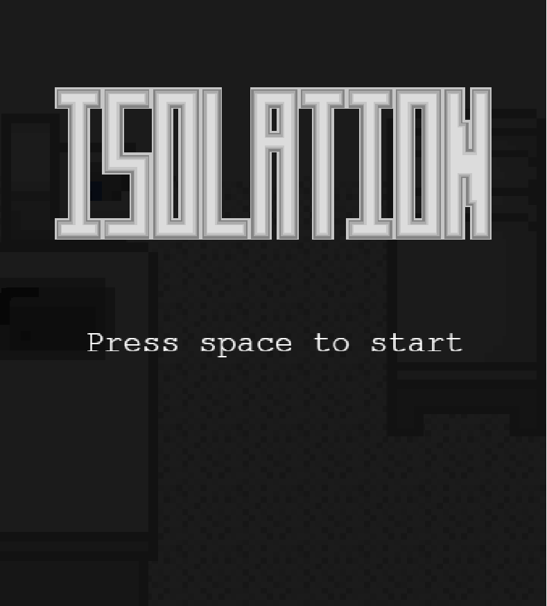
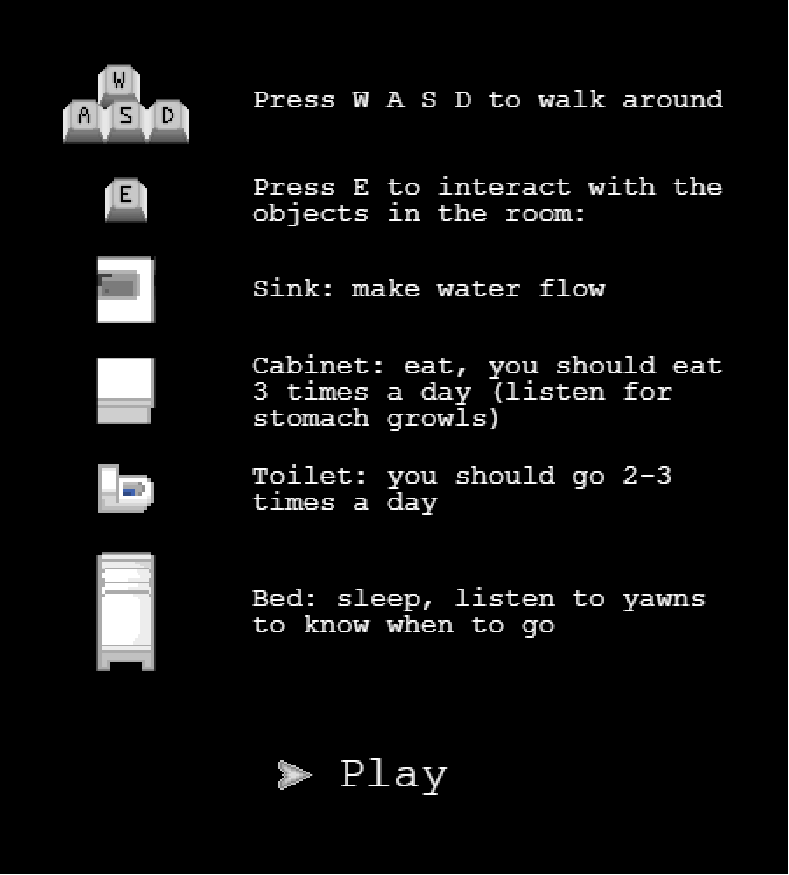
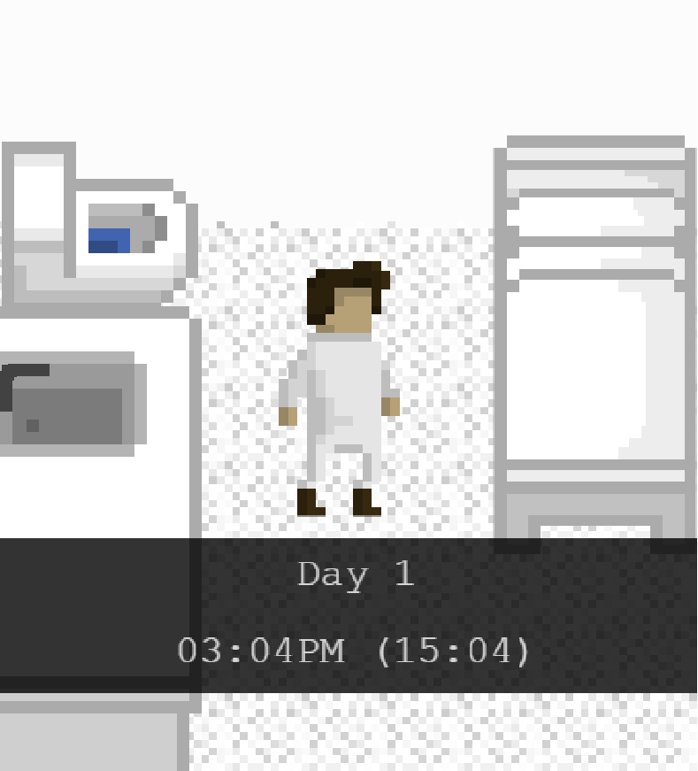

# Isolation

### **Isolation** is a video game developped in the context of [Isaac Pante](https://github.com/ipante)'s class "[développement de jeu vidéo 2D](https://github.com/ipante/ressources_cours_jeux_video_2D)."

You can read the [Original game specifications (old, in French)](http://bit.ly/LRJV2D) or read along to learn more.

The game is playable [here](https://digitaldw.github.io/Isolation/pages/index.html).

## What is the game about?

### Time and isolation
The whole idea of the game came to my mind when I saw Michael Stevens's first episode of [Mind Field](https://www.youtube.com/watch?v=GAPqEAWW9lc) about [isolation and boredom](https://www.youtube.com/watch?v=iqKdEhx-dD4). The two main observations from the video were that:
1. Being isolated inside a "boring room" (a room that does not have any notable feature) for a long time have may effects on the individual, especially on his/her sense of time and his/her mental state. There are quite a few examples and testimonies as well as the experience Stevens goes through there seem to corroborate this observation.
2. Being extremeley bored can make people think of anything to get stimulated - including self-harm. This observation also applies in the examples and the experiences in the original video.
The goal of this video game is to allow people to go through the same experience as Stevens: they are put inside a small, grey-scale, boring room that doesn't offer any distrations. They have to spend 3 days inside the room. They don't have any access to time informations, except the ones specified below.

### How does the game work?
The game wants to emulate the isolation Stevens lives in the video. The room was designed following Stevens' room. The player is only allowed to walk around, eat, go to the toilet and go to sleep. Here are a few rules that **always** apply in-game:
1. Your character has to eat 3 times a day: breakfast, lunch, dinner. Their stomach will growl when you need to eat.
2. Your character needs to go to the toilets 2 or 3 times a day. There are no specific time when you should go to the toilet, you just have to think about it.
3. Your character sleeps for 7 to 8 hours, or so they think. What I mean is: whenever the character wakes up, they will think that it's between 7 and 8 in the morning. Even if it really isn't.
4. Your character spends 72 hours in the room. You will only play 72 minutes as 1 minute in our real time playing the game corresponds to 1 hour for the character.
5. Eating and going to bed early or late WILL accelerate or decelerate the character's perception of time.
6. The character's moral descreases over time (about 1 / (1/4th of the game's duration in seconds)) but WILL decrease faster if the character's perception of time accelerates.

You will be told the time when you enter a new game or load a saved game. You will also be told the time when you wake up.

These should be the guiding rules for a proper handling of the game's mecanics.

### How does the game fit into the themes and experiences in the video?
Time dialation and moral decrease are two very obvious side effects of Stevens' isolation. Losing the sense of time and relying only on your biological clock makes it hard to stay in touch with reality. Also, the game is purposely boring - at least, it purposely doen't offer many distractions (except maybe for opening the tap). This aims to make the player unconfortable, hopefully pushing him/her to try and invent their own mini game to pass time.

